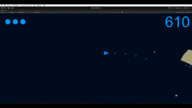
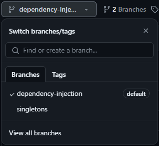

Unity version: 2022.3.14f1

Scene: "Assets/Scenes/Main"

---
**Unity | 2D | C# | Shooter | Mobile | Programming patterns | Custom editors | Scriptable objects**

Asteroids is a space-themed multidirectional shooter arcade video game. The player controls a single spaceship in an asteroid field which is periodically traversed by flying saucers. [[source]](https://en.wikipedia.org/wiki/Asteroids_(video_game))

- A great example of commonly used programming patterns
- Available in 2 versions: 
    - with singletons
    - with dependency injection

---
**Features**
- All geometry is generated programmatically
- Game settings stored as scriptable objects
- Customizable power ups as scriptable objects
- Caching of frequently used properties 
- Moving between game states is implemented as a state machine

---
**Used programming patterns**
- Singleton (only in the 'singleton' version)
    - *The Singleton pattern ensures that a class has only one instance and provides a global point of access to that instance. It is commonly used to control access to a shared resource, manage a unique instance, or centralize a system-wide operation.*
- Dependency Injection (only in the 'dependency injection' version)
    - *Dependency Injection is a design pattern where components are given their dependencies rather than creating or managing them internally. This promotes a more flexible and modular design, allowing for easier testing, maintenance, and future modifications by reducing the tight coupling between components.*
- Object Pooling
    - *Object Pooling is a pattern that involves pre-creating and maintaining a pool of reusable objects rather than creating and destroying them dynamically. This helps to minimize the overhead of object creation and destruction, especially in scenarios where creating new instances is resource-intensive, improving performance and efficiency.*
- Finite State Machine
    - *A Finite State Machine (FSM) is a computational model that can be in one of a finite number of states at any given time. Transitions between states are triggered by specific events, resulting in a change of behavior. FSMs are commonly used for modeling complex systems with distinct, well-defined states and transitions. They provide a structured way to manage the state of an object or system.*

---
**Switching between implementations (dependency injection/singletons)**

To switch between the implementations, simply choose one of the branches in the repository. The branches names are self-explanatory.

